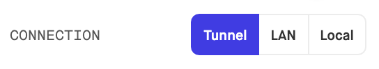

# Inertia Systems Mobile Coding Assignment

Congrats! We have decided to move forward with the interview process with you. For this part of the interview we would like for you to do a small at home assessment. To get an idea of how you think and solve problems. Be sure to use `git` when completing the assignment so we can see what you did gradually.

## Setup

We will be using [expo](https://expo.io/) to help us setup the assignment quickly.

```
npm install -g expo
expo init
```

When prompted choose `blank`

```
? Choose a template: (Use arrow keys)
  ----- Managed workflow -----
❯ blank                 a minimal app as clean as an empty canvas <--- THIS ONE
  blank (TypeScript)    same as blank but with TypeScript configuration
  tabs                  several example screens and tabs using react-navigation
  ----- Bare workflow -----
  minimal               bare and minimal, just the essentials to get you started
  minimal (TypeScript)  same as minimal but with TypeScript configuration
```

Name the project `InertiaSystemMobileCodingAssignment`

```
? What is the name of your project? InertiaSystemMobileCodingAssignment
```

Let expo build your project folder

```
cd InertiaSystemMobileCodingAssignment
yarn start
```

Doing this will setup an expo server which makes for easy and quick development. All you will need to do after, if you are unfamiliar with `expo`, is download expo [here](https://apps.apple.com/us/app/expo-client/id982107779). Once downloaded on your phone or table you can scan the QR code and access the application. Make sure to choose the `Tunnel` type of connection.



This will make it so you do not have to be on he same network as your computer to access the application.

## The Assignment

Create a two screen application. The first screen will consist of two components.

### Screen 1:

- Button to navigate to the second screen that is described below.
- Button that when pressed will increment a count that is displayed in the label of the button.  _See example below:_ 


### Screen 2:

On the second screen it will also consist of two components - _`back`_ button that goes back to the original screen - A searchable and sortable list of our favorite lunch spots!

#### For the list you can issue a GET request to this [endpoint](https://devapi.inertia.systems/devtest/lunchspecials.php).  It will contain a `JSON` response body with a field containing a list of restaurants and our favorite dish there.

```
{
  id: number,
  name: string,
  dish: string
}
```

For the search if a user inputs `soup` it should match both the `name` and `dish` fields in the objects. For example if given the list:

```
[
  {
    id: 1,
    name: "Soup Kitchen",
    dish: "Chicken Noodle Soup"
  },
  {
    id: 2,
    name: "Eveything Bowls",
    dish: "Noddle Soup"
  },
  {
    id: 3,
    name: 'In-n-out Burger"
    dish: "Double Double Burger"
  }
]
```

If the input is `Soup`, `soUp`, `sup` or `nodle`. Then ids `1` and `2` should be on the list, whereas id `3` should not. The search should be able to handle minor misspellings or forgotten letters

You should be able to sort by `id`, `name` or `dish` by touching the header of each column.

## Submission

Please email your hiring manager at Inertia Systems with a subject line as "_Your Name_ - Inertia Mobile Coding Assignment" with a link to your [Github](www.github.com) with the code sample or a *zip* file containing the code sample.
